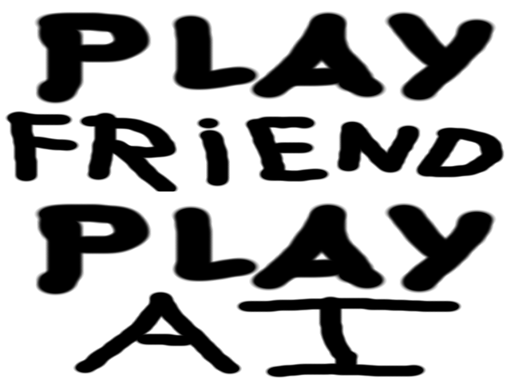
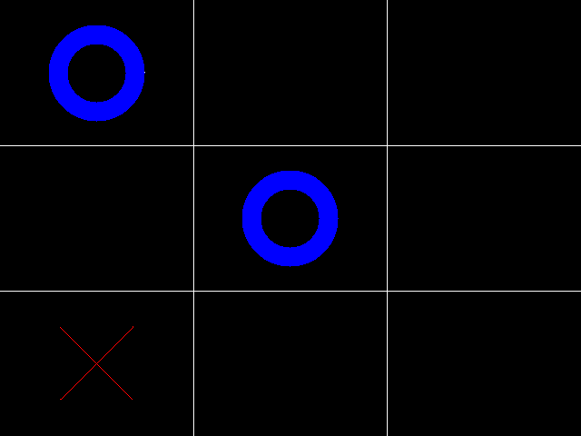
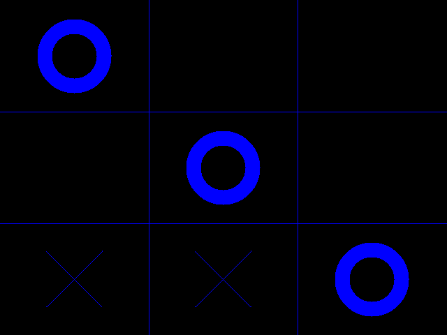

# Tic-Tac-Toe in SDL2

There's a 2 player mode and a versus AI mode.

The AI is implemented using the minimax algorithm. 

To play, click on the desired mode. Once you are playing, click on the space you want to mark in the grid. 

SDL2 needed for compilation.

### Compilation instructions
```
make
./tictactoe
```

### Screenshots




